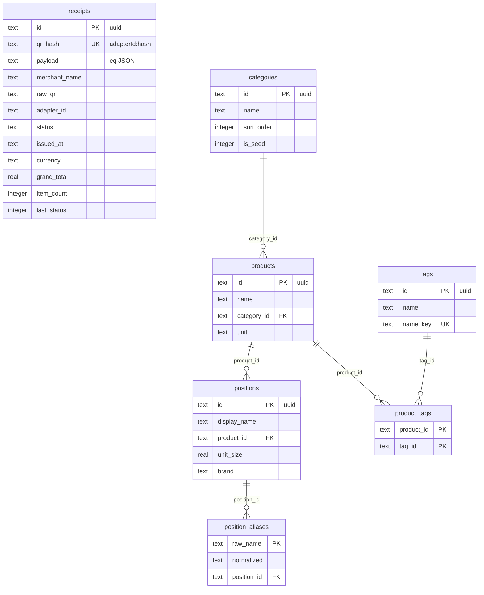
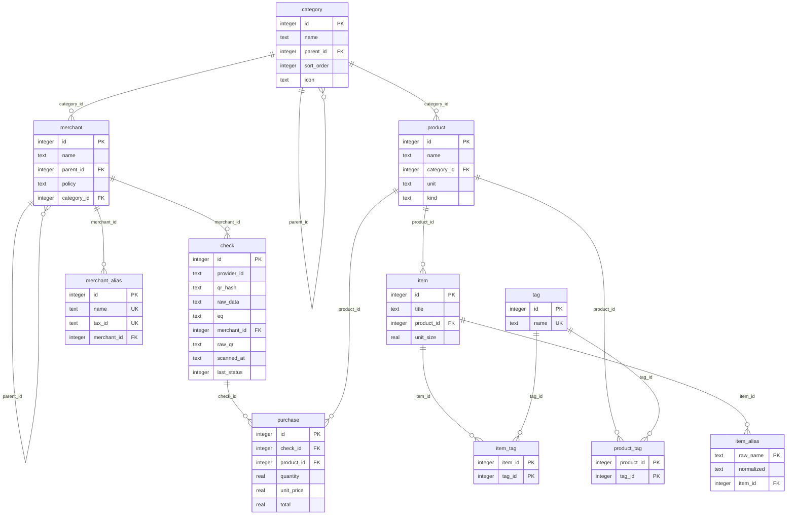

# Модель данных

Задачи в [tasks.md](tasks.md) опираются сюда. Экраны: [screens.md](screens.md). Сценарии: [usecases.md](usecases.md).

В SQLite три полезных типа: `integer`, `real`, `text`. Отдельного `varchar` нет — это тот же `text`. На старых ERD везде стояло `text`, в том числе на числах: это была подпись mermaid, не схема.

- `integer` — PK/FK каталога и кэша (`INTEGER PRIMARY KEY`), флаги, порядок
- `real` — деньги, количество, фасовка
- `text` — имена, enum, JSON, `provider_id`, хеш QR

`text` в id каталога и чека не нужен: это не ключ для FK. Сейчас в БД uuid-строки — наследие. Дедуп чека — `UNIQUE (provider_id, qr_hash)`.

## Сейчас

Чек не связан с каталогом: строки живут внутри `payload` (JSON). `merchant_name` — строка, не сущность. Категории плоские.



`receipts` на диаграмме один: в SQLite на каталог FK нет. Резолв идёт по строке `EqItem.description` → `position_aliases.raw_name`.

## Сущности

**Category** — полка, на которую кладут траты. Верх («Продукты», «Для дома») совпадает с конвертом в Savvy. Низ («Молоко», «Бакалея») нужен только здесь: сколько ушло на молочку или снеки.

**Product** — то, что человек считает одним товаром, несмотря на марку и пачку. «Молоко», «Спагетти», «Проезд». Сюда смотрят динамика цены и кэш покупок.

**Item** — как этот товар обычно написан на кассе: конкретная фасовка и привычное название. Не строка одного чека, а карточка в каталоге.

**Tag** — свободная метка. Вешается на товар («снеки») или на кассовое название («премиум», «Haribo»). Класса больше нет: ширпотреб/норм — обычные теги, если понадобятся. «Траты зря» на Главной режет по низу и по тегам товара; отдельной вкладки «статистика» нет.

**Item alias** — сырой текст из чека, приклеенный к item. «JOGURT GUSTI 2.8%» и «Jogurt Moja Kravica XXL» — два алиаса одной карточки.

**Merchant** — кто продал: сеть или точка. «Maxi», «Магнит», «JGSP». Без родителя — нормально (рынок, кафе). Политика решает, разбирать ли состав чека.

**Merchant alias** — имя или ИНН, как они пришли в чеке. «DELHAIZE SERBIA DOO BEOGRAD» указывает на Maxi.

**Check** — один визит на кассу: QR или ручная запись с рынка. Внутри сырой ответ API и нормализованный eQ.

**Purchase** — кэш: этот товар купили в этом чеке, за столько. Не правда, а ускорение. Магазин и дата читаются с чека, название — с товара.

## Цель

Одна схема. `purchase` — кэш, не источник правды. В mermaid он в том же графе.

```
хранение:  category ── product ── item ── alias
                │         └── tag       └── tag
           merchant(parent?) ── alias
                │
                └── check
────────
кэш:       purchase
```



Тег один на весь каталог. Связи — две таблицы: `product_tag` и `item_tag`.

Связи, которых в FK нет и не будет: `eq.items[].description` → `item_alias.raw_name` (строковое, только при `policy = parse`). `parent_id` у category/merchant и `merchant_id` у check — nullable.

`eq.items` — строки конкретного чека (qty, цена). `item` — как это написано на кассе в каталоге. Сейчас таблица называется `positions`.

## category

Полка для трат. Два уровня, одна таблица. Внук запрещён. Удаление верха каскадом удаляет детей; у товаров `category_id` → null.

- id [pk] `integer`
- name `text` — ключ `#GROCERIES` или свой заголовок
- parent_id `integer` [fk category.id, nullable] — пусто = верх (Savvy)
- sort_order `integer`
- icon `text` — emoji, не флаг сида

Сиды не помечаем колонкой. Локализация: `name` начинается с `#` → ключ l10n, как сейчас `#dairyEggs`. Своя категория — обычная строка. `is_seed` убираем: ассисту достаточно самого `#…`.

Товар на низ. Нет детей (Кафе) — на верх.

## product

Товар в голове человека, не на ценнике. Молоко Лебедянь 1.5% и Станция Молочная 2.5% — один product, если так решили.

- id [pk] `integer`
- name `text`
- category_id `integer` [fk, nullable]
- unit `text` — шт / упак / кг / г / л / мл
- kind `text` — `good` | `service`

Теги — через `product_tag`.

## item

Карточка «как на кассе»: пачка и привычное название. Строка конкретного чека живёт в `eq.items`.

- id [pk] `integer`
- title `text`
- product_id `integer` [fk, nullable]
- unit_size `real`

Бренда и класса нет. Марка — в `title`. Ширпотреб / премиум — теги на item, если нужны.

Алиас: `raw_name` + `normalized` → item. Без него «Jogurt Moja Kravica» и «JOGURT GUSTI 2.8%» не склеятся.

Теги — через `item_tag`.

## tag

Один словарь меток.

- id [pk] `integer`
- name `text` UK

`product_tag` / `item_tag`: пары `(product_id, tag_id)` и `(item_id, tag_id)`.

«Траты зря» ([screens.md](screens.md)) — низ + теги **товара** за период, из `purchase`. Теги item в этот разрез не входят: в чеке два item одного product схлопнуты. Отдельного экрана «статистика по тегам» нет.

## merchant

Продавец. Сеть к точке — как product к item, но точка без сети не «незавершёнка» (JGSP, рынок, кафе).

- id [pk] `integer`
- name `text`
- parent_id `integer` [fk, nullable] — сеть
- policy `text` — `parse` | `ignore`
- category_id `integer` [fk, nullable] — верх; при `ignore` категория всего чека

Алиас `merchant_name` / ИНН → merchant. На старте алиасы вешаем сразу на «Maxi», «Магнит», без точек. Сравнение цен: `parent_id ?? id`.

`parse` — строки в каталог. `ignore` — JGSP, Konoba, Yettel; маршруты и «Цезарь» не инжестить.

## check

Один чек: скан или запись с рынка.

- id [pk] `integer` — внутренний, для FK
- provider_id `text` — `ru_fns`, `rs_purs`, `manual`
- qr_hash `text` — `sha256(raw_qr)` hex; для ручного — хеш канонического `eq`
- raw_data `text` — JSON ответа API
- eq `text` — JSON EqReceipt
- merchant_id `integer` [fk, nullable] — пока не сматчили алиас
- raw_qr `text` — у `manual` пусто
- scanned_at `text` — когда записали; дата покупки в `eq`
- last_status `integer`

UNIQUE `(provider_id, qr_hash)`: один QR у одного провайдера → одна строка. Не склеивать в id.

Ручной чек: хеш от первого сохранённого `eq`. Правка состава id не меняет — иначе каждая правка плодит новый чек.

Для списка истории сумма, дата и валюта либо парсятся из `eq` каждый раз, либо дублируются на `check` (как сейчас `grand_total` / `issued_at`). Иначе История тормозит. `tax_id` у алиаса: пустая строка не UNIQUE, только NULL.

`source` нет: ручной чек = `provider_id = manual`. Не дублировать.

Сейчас id — uuid, дедуп по `receipts.qr_hash` (`adapterId:hash`).

`eq` — то, чем живёт приложение. `raw_data` пишет провайдер.

## purchase (кэш)

Запись «молоко в этом чеке стоило столько». Зерно — product, не item. Магазин, дата, валюта — с `check` / `eq`. Имя и единица — с `product`.

- id [pk] `integer` autoincrement
- check_id `integer` [fk]
- product_id `integer` [fk] — без товара строки нет
- quantity, unit_price, total `real`

UNIQUE `(check_id, product_id)`. Две строки одного товара в чеке складываются. Пересчёт при записи чека и при смене `item.product_id`.

`ignore` и неназначенные item не пишем. Фасовка и теги item в кэш не входят. ₽/кг на карточке товара: какая пачка, если у молока их несколько — брать эталон (например большую / последнюю), не среднее из кэша. Пересчёт `purchase` — одно место, все смены `item.product_id`.

## Не таблицы

Savvy — маппинг верха category, не схема здесь; пункт в Настройках. Список — экран из темпа и цен ([screens.md](screens.md)), не таблица. Срок, рецепты, почта, акции — нет.
