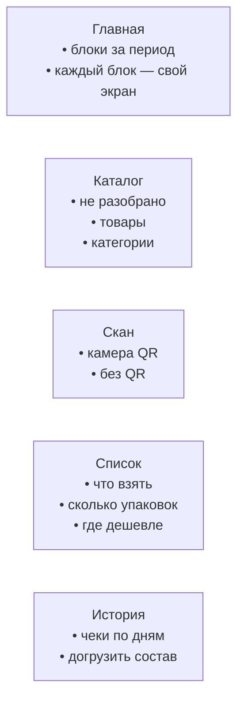
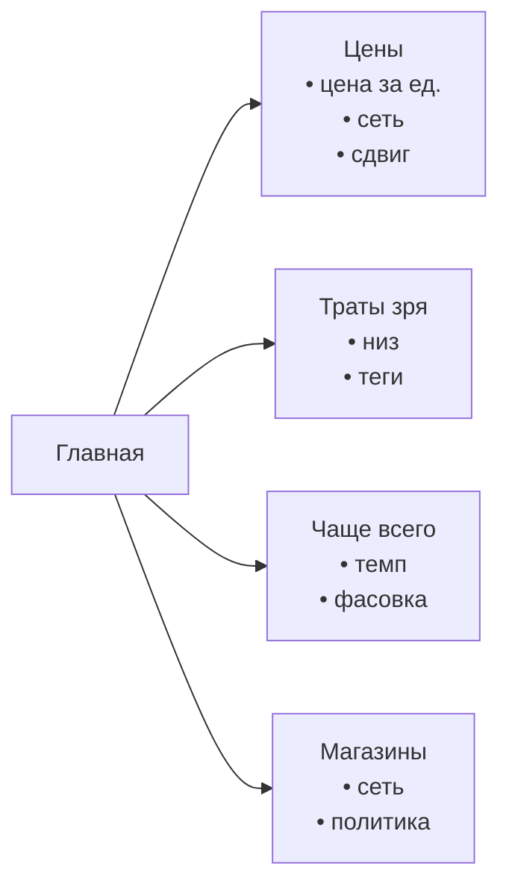
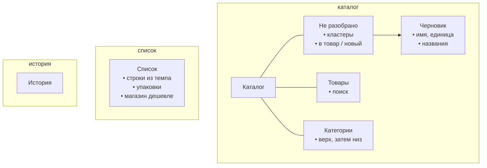

# Карта экранов

Сценарии: [usecases.md](usecases.md). Модель: [model.md](model.md). Задачи: [tasks.md](tasks.md).

```
[ Главная ]   [ Каталог ]   (скан)   [ Список ]   [ История ]
```

Список — вкладка у кассы, не аналитика. Цены на Главную: там блоки-тизеры, каждый открывает свой экран. Пока нет честных `unitSize` и товара, список пустой (3.1), слот уже занят.

Скан по центру, поверх вкладки. Товар, чек, магазин — общие, не принадлежат бару.

## Бар



## Главная

Шапка: месяц ← →, сумма, число чеков. Шестерёнка → настройки.

Дальше блоки. На блоке — одна цифра или три строки, не график. Тап ведёт на экран этого разреза.



| Блок | Тизер | Экран |
| --- | --- | --- |
| Цены | товар, ₽/ед, сеть дешевле | список своих товаров: цена, сеть, динамика → Товар |
| Траты зря | сумма за период | низ и теги за период → Товар / Категория |
| Чаще всего | 3 товара | темп покупок; отсюда же потом строки в Список |
| Магазины | сколько без сети / политики | список продавцов → Магазин |

Верх (конверт Savvy) на Главной не режем. «По категориям» как сейчас — нет.

## Остальные стеки



Скан не стек: камера закрывается. Ручной чек — модалка с той же кнопки.

## Общие экраны

| Экран | Откуда | Делает |
| --- | --- | --- |
| Товар | Каталог, Цены, Чаще всего, Траты зря, Чек, Список | имя, низ, единица, kind, теги; названия и их теги; поиск и кандидаты; ₽/ед и график; отвязать |
| Категория | Каталог, Траты зря | верх или низ; дети либо товары |
| Магазин | Магазины, Товар, Список | сеть, parse/ignore, верх, алиасы |
| Чек | История, Скан, Ручной чек | состав или одна сумма при ignore; обновить жестом; удалить |

Крошки — одна кнопка, попап предков (0.3).

## Модалки и шиты

| Что | Откуда | Делает |
| --- | --- | --- |
| Скан | бар | QR → Чек |
| Ручной чек | скан «без QR»; позже плюс в Истории | рынок: магазин, дата, известные товары |
| Настройки | Главная | токены; позже Savvy |
| Назначить | Чек, Каталог | название → товар |
| Ассист | Каталог | промпт / JSON; потолок кластера |
| Онбординг | первый запуск | камера |

## Что не рисуем

| Экран | Почему |
| --- | --- |
| Цены как вкладка | это блок Главной, не ежедневный вход |
| Статистика как вкладка | дубль Главной |
| Конверты / остаток | Savvy |
| Почта, акции, срок, рецепты | не сейчас |

Экспорт в Savvy — пункт в Настройках.
