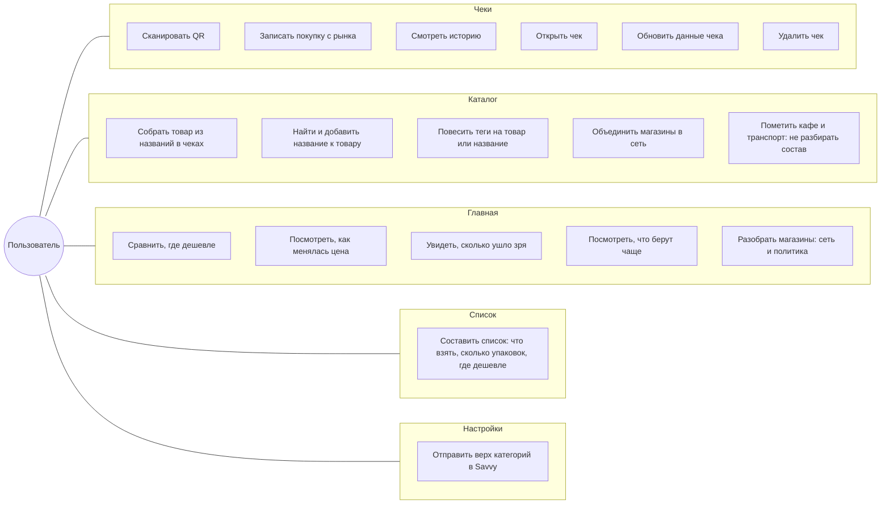

# Что можно делать

Экраны: [screens.md](screens.md). Модель: [model.md](model.md).

```mermaid
flowchart LR
  U((Пользователь))

  subgraph Чеки
    A[Сканировать QR]
    B[Записать покупку с рынка]
    C[Смотреть историю]
    D[Открыть чек]
    E[Обновить данные чека]
    F[Удалить чек]
  end

  subgraph Каталог
    G[Собрать товар из названий в чеках]
    H[Найти и добавить название к товару]
    I[Повесить теги на товар или название]
    J[Объединить магазины в сеть]
    K[Пометить кафе и транспорт: не разбирать состав]
  end

  subgraph Главная
    L[Сравнить, где дешевле]
    M[Посмотреть, как менялась цена]
    N[Увидеть, сколько ушло зря]
    O[Посмотреть, что берут чаще]
    P[Разобрать магазины: сеть и политика]
  end

  subgraph Список
    Q[Составить список: что взять, сколько упаковок, где дешевле]
  end

  subgraph Настройки
    R[Отправить верх категорий в Savvy]
  end

  U --- Чеки
  U --- Каталог
  U --- Главная
  U --- Список
  U --- Настройки
```
